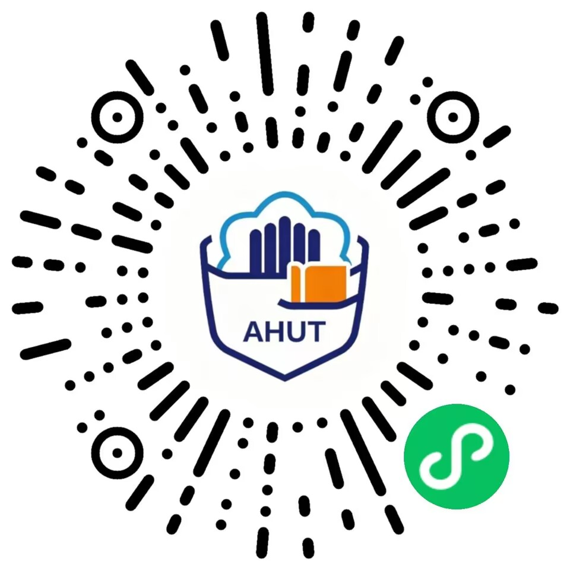

# Hi, I'm sure

## 个人经历

- Java / Go 后端开发方向，正在向全栈开发拓展
- 做过已上线微信小程序，关注从需求、接口、数据库到部署上线的完整链路
- 目前重点学习：后端工程化、数据库设计、系统安全、前端与小程序开发

  
  
  
  
  

## 项目经历

<table>
  <tr>
    <td width="50%" valign="top">
      <h3>校园闲置集市 Campus Trade</h3>
      

        面向安徽工业大学学生的校园闲置信息公告栏，包含微信小程序、Spring Boot 后端、图片审核台、商品管理和公告管理后台。
      

      

        <a href="https://github.com/sure141319/wx-school-app">Repository</a>
        ·
        <a href="https://www.ahut-campus.site">Production API / Site</a>
      

      

        <strong>Tech:</strong> Java 17, Spring Boot 3.3, MyBatis, MySQL, Redis, MinIO, Flyway, JWT, WeChat Mini Program
      

      <ul>
        <li>设计商品发布、搜索筛选、详情浏览、上下架和审核状态流转</li>
        <li>实现 JWT 认证、BCrypt 密码加密、登录失败锁定、验证码频控和管理员权限控制</li>
        <li>接入 MinIO 对象存储，处理图片上传、格式校验、WebP 变体和上传对象生命周期</li>
        <li>用 Flyway 管理数据库迁移，并通过 Maven Test、契约测试和 GitHub Actions 做质量门禁</li>
      </ul>
      

        
      

    </td>
    <td width="50%" valign="top">
      <h3>口袋安小工 PocketAHUT</h3>
      

        面向安徽工业大学学生的一站式校园生活服务平台，覆盖课表、成绩、考试、空教室、电费、食堂、校园新闻等常用场景。
      

      

        <a href="https://github.com/zreason-group/PocketAHUT">Repository</a>
        ·
        <a href="https://github.com/zreason-group/PocketAHUT/releases/">Releases</a>
      

      

        <strong>Role:</strong> 开发 & 测试贡献者
         
        <strong>Tech:</strong> VitePress, pnpm, GitHub Actions, WeChat Mini Program ecosystem
      

      <ul>
        <li>参与校园服务平台的功能开发、测试和文档完善</li>
        <li>围绕教务学习、宿舍电费、空教室、食堂、体测等高频场景整理功能说明</li>
        <li>维护 VitePress 文档站，让新用户和贡献者更快理解平台能力</li>
        <li>在团队项目中进行协作开发，关注可读文档、问题反馈和上线体验</li>
      </ul>
      

        
      

    </td>
  </tr>
</table>

## 技术栈

  

  
  
  
  

